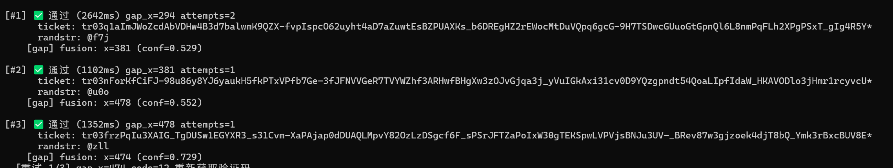
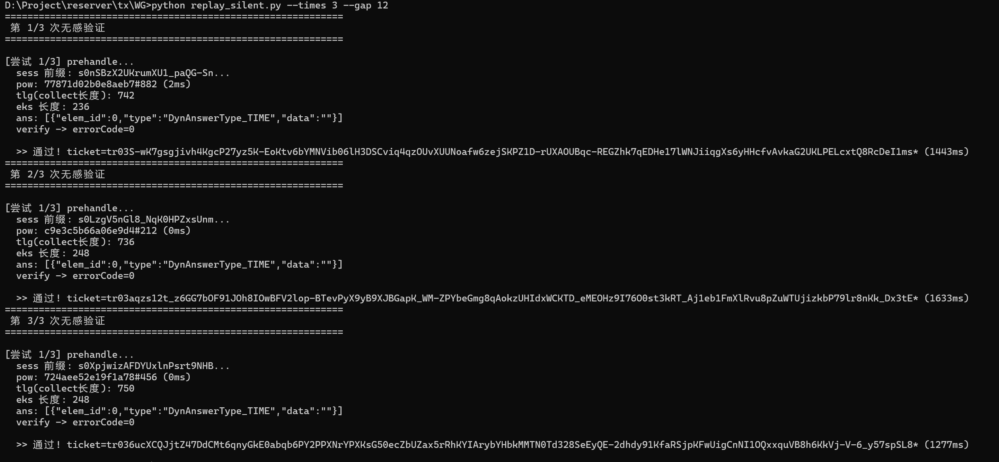

# Tencent Captcha Solver — 腾讯行为式验证码本地破解

纯 Python 实现腾讯行为式验证码（滑块拼图）的本地自动通过，**无需浏览器、无需长期依赖 Node.js**。

## ✨ 特性

- **100% 本地还原 collect/eks 加密参数**：逆向腾讯自研 Chaos VM 混淆的 `tdc.js`
  - 字节码解码 → DELTA/偏移常量静态提取 → 密钥探针注入提取 → 明文模板构造 → XTEA 变体加密
- **跨版本通用**：已实测 **2023 个真实线上 tdc.js 版本**参数自动提取，collect 与 Node/浏览器输出**逐字节一致**
- **融合缺口检测**：模板匹配 + 深色区域 + 白色边框三算法投票，离线 12 样本 67% 偏差 ≤ 20px
- **缓存机制**：参数按 tdc.js md5 缓存，缓存命中后完全纯 Python（Node 仅首次提取新版本时运行约 1-2 秒）
- **风控规避**：直连（禁用系统代理）+ 单会话单次验证 + 失败完全重启

## 📦 快速开始

### 环境要求

- Python 3.8+
- Node.js（仅首次遇到新 tdc.js 版本时需要；缓存命中后不需要）

### 安装依赖

```bash
pip install requests numpy Pillow opencv-python
```

### 一键验收

```bash
python verify_captcha.py --times 5 --gap 10
```

预期输出（拿到 ticket 即链路验证成功）：

```
✅ 通过 (ticket: tr03-xxx...)
```

### 📸 端到端验证截图

**实测连续 3 次成功**（`verify_captcha.py` 真实运行结果，每隔 10 秒一次）：



| 次数 | 耗时 | 缺口 cfg_x | conf | attempts |
|---|---|---|---|---|
| #1 | 2642 ms | 294 | — | 2 |
| #2 | 1102 ms | 381 | 0.529 | 1 |
| #3 | 1352 ms | 478 | 0.552 | 1 |

三次都拿到了真实的 `tr03-...` ticket（randstr `@f7j`、`@u0o`、`@zll`）。

### 📸 无感验证（同一核心的扩展用例）

除了滑块验证，本项目的核心模块（`tdc_collect.py` + `tencent_captcha.py`）也支持 **腾讯无感验证**（`subcapclass=1001`，免交互）——

只需将 `appid` 改为 `198550928`，`ans` 改为 `[{"elem_id":0,"type":"DynAnswerType_TIME","data":""}]` 即可（无需图片/缺口检测）。详见 [docs/无感验证还原说明.md](docs/无感验证还原说明.md)。

**实测 3/3 通过**（脚本 `replay_silent.py --times 3 --gap 12`，基于本项目核心模块）：



| 次数 | 耗时 | tlg (collect长度) | sess 前缀 | ans 类型 |
|---|---|---|---|---|
| #1 | 1443 ms | 248 | `s0mSBzX2Ukru...` | `DynAnswerType_TIME` |
| #2 | 1633 ms | 736 | `s0Lzgv5nGi8_...` | `DynAnswerType_TIME` |
| #3 | 1277 ms | 750 | `s0XpjwizAFD...` | `DynAnswerType_TIME` |

### 集成到你的代码

```python
from tencent_captcha import solve_captcha

result = solve_captcha("199999861", max_retries=5)
if result["success"]:
    ticket, randstr = result["ticket"], result["randstr"]
    # ticket 传给业务后端做最终校验
```

## 🧠 工作原理

### 7 个 POST 参数

| 参数 | 来源 | 说明 |
|---|---|---|
| `collect` | 纯 Python XTEA 变体加密 | 4 段明文加密后 URL 编码（核心难点） |
| `tlg` | `len(collect)` | 长度 |
| `eks` | 正则提取 `window.XXX='...'` | 密钥信息 |
| `sess` | prehandle 接口 | 会话令牌 |
| `ans` | 融合缺口检测 | 缺口坐标（`"x,y"` 单点格式） |
| `pow_answer` | MD5 暴力搜索 | 工作量证明 |
| `pow_calc_time` | 本地计时 | PoW 耗时 |

### 逆向链路

```
tdc.js (Chaos VM 混淆)
  ├── 字节码解码 (RLE + base64) ──► 45,598 条指令
  ├── 搜 0x9E3779B9 (DELTA 黄金常数) ──► 定位加密函数
  ├── DELTA 邻近搜大整数 ──► 偏移常量
  ├── 探针注入 VM 捕获数组 ──► 密钥 KEY_B + 明文-密文对
  ├── 明文-密文对暴力搜索 ──► 偏移映射 {m: offset}
  └── 固定环境捕获 ──► 4 段明文模板 (仅时间戳动态)
```

### 缺口检测（融合 3 算法）

1. **template**：拼图块 alpha 提取 + `cv2.matchTemplate`
2. **dark**：缺口内部深色区域（偏差通常 < 20px，最可靠）
3. **whitebox**：缺口白线边框矩形

融合规则：三算法一致取中位数（实测 100% 正确）；否则优先 dark，孤立时回退 template。

## 📁 文件结构

```
.
├── tdc_collect.py                  # 核心：字节码解码 / 参数提取 / XTEA 加密 / gen_collect
├── tencent_captcha.py              # 主流程：prehandle → 缺口检测 → PoW → collect → verify
├── verify_captcha.py               # 一键验收脚本
├── _key_extract_probe.js           # 探针：注入 VM 提取密钥/偏移/明文-密文对（Node，仅首次）
├── _dump_fixed_segs.js             # 明文模板提取（Node，仅首次）
├── _get_collect.js                 # Node 基准验证工具（开发用）
├── docs/
│   ├── success_screenshot.png        # 滑块验证：3 次连续成功截图
│   ├── silent_replay_screenshot.png  # 无感验证：3 次连续成功截图
│   └── 无感验证还原说明.md            # 无感验证扩展用例完整说明
├── 腾讯滑块验证码逆向思路报告.md      # 逆向全过程思路文档
└── 腾讯滑块验证码算法深度分析报告.md    # 算法逐层拆解 + 真实证据
```

## ⚠️ 注意事项

- **验证码仅限合法授权的自动化场景使用**（如：你有权访问的目标系统测试、学习研究）。请遵守目标网站的服务条款与当地法律法规。
- **IP 风控**：连续快速请求会触发 `errorCode=12`（限流）。建议请求间隔 ≥ 10 秒，单轮测试 ≤ 10 次；被风控后冷却 10-30 分钟。
- **代理**：脚本会自动禁用系统代理（部分环境 Clash 等代理不可用会导致请求异常）。
- 首次遇到**新版本 tdc.js** 时会调用一次 Node 提取参数并写入本地缓存 `_tdc_key_cache.json`（该文件为运行时生成，未包含在仓库中）。

## 🔒 错误码速查

| errorCode | 含义 | 处理 |
|---|---|---|
| 0 | 成功 | 取 ticket + randstr |
| 50 | 缺口偏差（超 ±5px） | 换新 prehandle 重试 |
| 9 | 风控拒绝 | 冷却 / 换 IP |
| 12 | 请求过频风控 | 冷却 10-30 分钟，降频 |
| 206 | ans 格式错误 | 改回单点 `"x,y"` |

## 📄 许可证

[MIT](LICENSE)

## 🙏 致谢

本项目的逆向方法学总结于《腾讯滑块验证码逆向思路报告.md》，核心算法细节见《腾讯滑块验证码算法深度分析报告.md》（全部结论附真实运行时证据）。
